# Golden Hour Architecture

This document describes the multi-agent architecture of Golden Hour.

## Multi-Agent Flow Diagram

Below is the Mermaid flowchart representing how queries flow through the system:

```mermaid
graph TD
    UserQuery[User Query] --> RootAgent[root_agent]
    RootAgent --> SecurityGate{Security Gate Check}
    SecurityGate -- "Reject (Not Disaster)" --> RejectResponse[Rejection Message]
    SecurityGate -- "Allow (Is Disaster)" --> Routing{Route by Disaster Type}
    
    Routing -- Flood --> FloodAgent[flood_agent]
    Routing -- Earthquake --> EarthquakeAgent[earthquake_agent]
    Routing -- Cyclone --> CycloneAgent[cyclone_agent]
    Routing -- Help/Donations --> HelperAgent[helper_agent]
    
    %% flood_agent API calls
    FloodAgent --> FloodAPI1[fetch_gdacs_events]
    FloodAgent --> FloodAPI2[fetch_flood_forecast]
    
    %% earthquake_agent API calls
    EarthquakeAgent --> EQAPI1[fetch_usgs_earthquakes]
    EarthquakeAgent --> EQAPI2[fetch_usgs_event_detail]
    EarthquakeAgent --> EQAPI3[fetch_gdacs_earthquake_events]

    %% cyclone_agent API calls
    CycloneAgent --> CycloneAPI1[fetch_gdacs_cyclone_events]

    %% root_agent API calls
    RootAgent --> ActiveDisastersAPI[fetch_active_disasters]
    
    %% Outputs
    FloodAPI1 & FloodAPI2 --> BuildFloodPackets[Generate 5 Output Packets]
    EQAPI1 & EQAPI2 & EQAPI3 --> BuildEQPackets[Generate 5 Output Packets]
    CycloneAPI1 --> BuildCyclonePackets[Generate 5 Output Packets]
    HelperAgent --> HelperFlow[Generate Tailored Guidance]
    
    BuildFloodPackets --> P1[Packet 1: District Commander]
    BuildFloodPackets --> P2[Packet 2: Search & Rescue]
    BuildFloodPackets --> P3[Packet 3: Hospital & Medical]
    BuildFloodPackets --> P4[Packet 4: Transport & Logistics]
    BuildFloodPackets --> P5[Packet 5: Public Communication]
    
    BuildEQPackets --> P1_eq[Packet 1: District Commander]
    BuildEQPackets --> P2_eq[Packet 2: Search & Rescue]
    BuildEQPackets --> P3_eq[Packet 3: Hospital & Medical]
    BuildEQPackets --> P4_eq[Packet 4: Transport & Logistics]
    BuildEQPackets --> P5_eq[Packet 5: Public Communication]

    BuildCyclonePackets --> P1_cy[Packet 1: District Commander]
    BuildCyclonePackets --> P2_cy[Packet 2: Search & Rescue]
    BuildCyclonePackets --> P3_cy[Packet 3: Hospital & Medical]
    BuildCyclonePackets --> P4_cy[Packet 4: Transport & Logistics]
    BuildCyclonePackets --> P5_cy[Packet 5: Public Communication]

    style RootAgent fill:#f9f,stroke:#333,stroke-width:2px
    style FloodAgent fill:#bbf,stroke:#333,stroke-width:2px
    style EarthquakeAgent fill:#fbb,stroke:#333,stroke-width:2px
    style CycloneAgent fill:#fdf,stroke:#333,stroke-width:2px
    style HelperAgent fill:#dff,stroke:#333,stroke-width:2px
    style SecurityGate fill:#ff9,stroke:#333,stroke-width:2px
```

