# Golden Hour Disaster Response Agent

Golden Hour is an upgraded multi-agent disaster response system designed to serve disaster management teams, NDRF/first responder field commanders, hospital/medical coordinators, transport and logistics teams, and public communication officers. It processes plain-language user queries to produce structured, role-specific action briefs during floods and earthquakes.

---

## How the AI agents work together

Golden Hour uses a three-agent system to coordinate information routing and specialize in disaster types:

- **root_agent**: Acts as the initial security gate and orchestrator. It inspects all incoming plain-language user requests. If the request is not related to a supported natural disaster, it rejects it immediately. Otherwise, it routes the query to the correct specialist agent. It also determines the country context to use the appropriate emergency management authorities.
- **flood_agent**: Operating in *Anticipate Mode*, it queries GDACS and NOAA NWPS tools to assess active flood events and river stage levels, producing a detailed 5-packet disaster brief.
- **earthquake_agent**: Operating in *Respond Mode*, it fetches significant earthquake events from the USGS and active GDACS earthquake feeds, retrieves PAGER details, and produces a structured 5-packet situation assessment.

---

## Architecture

Below is the Mermaid flowchart representing the multi-agent orchestration, tool calls, and security checks. You can also view this in the [docs/architecture.md](file:///c:/Users/admin/agy2-projects/golden-hour/golden-hour-agent/docs/architecture.md) file.

```mermaid
graph TD
    UserQuery[User Query] --> RootAgent[root_agent]
    RootAgent --> SecurityGate{Security Gate Check}
    SecurityGate -- "Reject (Not Disaster)" --> RejectResponse[Rejection Message]
    SecurityGate -- "Allow (Is Disaster)" --> Routing{Route by Disaster Type}
    
    Routing -- Flood --> FloodAgent[flood_agent]
    Routing -- Earthquake --> EarthquakeAgent[earthquake_agent]
    Routing -- Cyclone --> CycloneAgent[cyclone_agent]
    Routing -- Help/Donations --> HelperAgent[helper_agent]
    
    %% flood_agent API calls
    FloodAgent --> FloodAPI1[fetch_gdacs_events]
    FloodAgent --> FloodAPI2[fetch_flood_forecast]
    
    %% earthquake_agent API calls
    EarthquakeAgent --> EQAPI1[fetch_usgs_earthquakes]
    EarthquakeAgent --> EQAPI2[fetch_usgs_event_detail]
    EarthquakeAgent --> EQAPI3[fetch_gdacs_earthquake_events]

    %% cyclone_agent API calls
    CycloneAgent --> CycloneAPI1[fetch_gdacs_cyclone_events]

    %% root_agent API calls
    RootAgent --> ActiveDisastersAPI[fetch_active_disasters]
    
    %% Outputs
    FloodAPI1 & FloodAPI2 --> BuildFloodPackets[Generate 5 Output Packets]
    EQAPI1 & EQAPI2 & EQAPI3 --> BuildEQPackets[Generate 5 Output Packets]
    CycloneAPI1 --> BuildCyclonePackets[Generate 5 Output Packets]
    HelperAgent --> HelperFlow[Generate Tailored Guidance]
    
    BuildFloodPackets --> P1[Packet 1: District Commander]
    BuildFloodPackets --> P2[Packet 2: Search & Rescue]
    BuildFloodPackets --> P3[Packet 3: Hospital & Medical]
    BuildFloodPackets --> P4[Packet 4: Transport & Logistics]
    BuildFloodPackets --> P5[Packet 5: Public Communication]
    
    BuildEQPackets --> P1_eq[Packet 1: District Commander]
    BuildEQPackets --> P2_eq[Packet 2: Search & Rescue]
    BuildEQPackets --> P3_eq[Packet 3: Hospital & Medical]
    BuildEQPackets --> P4_eq[Packet 4: Transport & Logistics]
    BuildEQPackets --> P5_eq[Packet 5: Public Communication]

    BuildCyclonePackets --> P1_cy[Packet 1: District Commander]
    BuildCyclonePackets --> P2_cy[Packet 2: Search & Rescue]
    BuildCyclonePackets --> P3_cy[Packet 3: Hospital & Medical]
    BuildCyclonePackets --> P4_cy[Packet 4: Transport & Logistics]
    BuildCyclonePackets --> P5_cy[Packet 5: Public Communication]

    style RootAgent fill:#f9f,stroke:#333,stroke-width:2px
    style FloodAgent fill:#bbf,stroke:#333,stroke-width:2px
    style EarthquakeAgent fill:#fbb,stroke:#333,stroke-width:2px
    style CycloneAgent fill:#fdf,stroke:#333,stroke-width:2px
    style HelperAgent fill:#dff,stroke:#333,stroke-width:2px
    style SecurityGate fill:#ff9,stroke:#333,stroke-width:2px
```



---

## How it works — step by step

1. **Step 1: User types a plain-language disaster query** — A user submits a query such as "What is the flood situation in Kerala?" or "Tell me about the latest earthquake in India" without needing to know any IDs.
2. **Step 2: root_agent validates — is this a disaster query?** — Before any external APIs are invoked or LLM reasoning takes place, the system validates the input against disaster keyword patterns. If the query is unrelated (e.g., "how to bake a cake"), it is rejected immediately.
3. **Step 3: If yes, root_agent detects disaster type and routes to specialist** — The [root_agent](file:///c:/Users/admin/agy2-projects/golden-hour/golden-hour-agent/app/agent.py#L321) determines the disaster category and delegates the task to either [flood_agent](file:///c:/Users/admin/agy2-projects/golden-hour/golden-hour-agent/app/agent.py#L207) or [earthquake_agent](file:///c:/Users/admin/agy2-projects/golden-hour/golden-hour-agent/app/agent.py#L258). It also extracts the geographic context to apply regional agencies and emergency contacts.
4. **Step 4: Specialist agent calls live government APIs automatically** — The specialist agent uses its tools to fetch live disaster and forecasting data from NOAA, USGS, or GDACS endpoints.
5. **Step 5: Agent produces 5 role-specific action packets** — The specialist agent leverages the [disaster-report-formatter](file:///c:/Users/admin/agy2-projects/golden-hour/golden-hour-agent/.agents/skills/disaster-report-formatter) skill to structure the output into 5 tailored packets for the District/Regional Commander, Search & Rescue Field Commander, Hospital & Medical Coordinator, Transport & Logistics Coordinator, and Public Communication Officer.
6. **Step 6: Response delivered in under 30 seconds** — The compiled response with all five action packets is delivered quickly and reliably to the user.

---

## Course Concepts Demonstrated

- **Multi-agent system (ADK)**: Built using the Google Agent Development Kit (ADK) in [app/agent.py](file:///c:/Users/admin/agy2-projects/golden-hour/golden-hour-agent/app/agent.py). It implements hierarchical orchestration with a supervisor agent ([root_agent](file:///c:/Users/admin/agy2-projects/golden-hour/golden-hour-agent/app/agent.py#L321)) delegating specifically to domain-expert sub-agents ([flood_agent](file:///c:/Users/admin/agy2-projects/golden-hour/golden-hour-agent/app/agent.py#L207) and [earthquake_agent](file:///c:/Users/admin/agy2-projects/golden-hour/golden-hour-agent/app/agent.py#L258)).
- **Security features**: Implemented robust input validation boundaries and policies. Key security features include:
  * Strict input validation check ([validate_disaster_query](file:///c:/Users/admin/agy2-projects/golden-hour/golden-hour-agent/app/agent.py#L180)) preventing API wastage and prompt injection.
  * Rejection gate logic inside [root_agent](file:///c:/Users/admin/agy2-projects/golden-hour/golden-hour-agent/app/agent.py#L321) to enforce safety bounds before invoking LLMs or external tools.
  * Localized response teams by country detection to prevent routing incorrect emergency contact instructions.
  * Audit logs using [hooks.json](file:///c:/Users/admin/agy2-projects/golden-hour/golden-hour-agent/.agents/hooks.json) to monitor all tool execution events.
- **Antigravity**: Used for developer workflow automation, environment workspace context management, and progressive disclosure design.
- **Agent skills (CLI)**: Leverages the [disaster-report-formatter](file:///c:/Users/admin/agy2-projects/golden-hour/golden-hour-agent/.agents/skills/disaster-report-formatter) custom skill located under [.agents/skills/disaster-report-formatter](file:///c:/Users/admin/agy2-projects/golden-hour/golden-hour-agent/.agents/skills/disaster-report-formatter) to isolate complex reporting schemas and ensure consistent output shapes.

---

## What the agent actually produces

Whenever a disaster query is processed, the system produces five role-specific, actionable packets:

- **Packet 1 - District / Regional Commander (DDMA / FEMA / NDRRMC)**: Decisions to make, population at risk, priority areas, and evacuation zone resources.
- **Packet 2 - Search & Rescue Field Commander (NDRF / Search & Rescue)**: Deployment priorities, building collapse risks, required search and rescue gear, and access routes.
- **Packet 3 - Hospital & Medical Coordinator**: Expected injuries (waterborne disease, crush syndrome, hypothermia), casualty range estimates, hospital surge activations, and blood bank reserve alerts.
- **Packet 4 - Transport & Logistics Coordinator**: Infrastructure damage assessments, alternative route suggestions, heavy debris removal equipment, and helicopter landing zones.
- **Packet 5 - Public Communication Officer**: Clean public advisories, crucial warnings (such as aftershocks or water safety rules), emergency help numbers, and shelter directions.

---

## Where the data comes from

Golden Hour pulls live information keylessly from five primary, public endpoints:

- **NOAA NWPS**: River stage flow data and forecasts (up to 10 days ahead) for specific gauges.
- **Open-Meteo GloFAS**: Global flood and discharge forecasts.
- **USGS GeoJSON + PAGER**: Significant earthquakes details, magnitude, depth, location, and shaking impact estimations.
- **GDACS Floods**: Active global flood events and alert severity categories.
- **GDACS Earthquakes**: Active global earthquake and seismic events.

---

## Security features

To safeguard disaster response environments, Golden Hour incorporates several security layers:

- **Non-disaster queries are rejected immediately**: Any query not matching disaster topics is caught at the front door.
- **Country detection uses correct local teams**: The system detects the country from the query location to map response briefs to appropriate native agencies (e.g. NDRF in India, FEMA in the USA, NDRRMC in the Philippines), preventing incorrect emergency instructions or phone numbers.
- **No API keys stored in code**: All tool integrations use public, keyless APIs, avoiding credentials leaking.
- **Input validation on all queries**: An input validation gate verifies keywords before initiating any LLM calls or tool lookups.
- **Audit hooks on all tool calls**: Built-in PreToolUse hooks log all tool invocations for compliance and audit trails.

---

## Project Structure

```
golden-hour-agent/
├── .agents/               # Security context policies and event hooks
│   ├── CONTEXT.md             # Security and scope guidelines
│   ├── hooks.json             # Pre-tool audit logs
│   └── skills/                # Custom Antigravity skills
├── app/                   # Core agent code
│   ├── agent.py               # Multi-agent layout, tools, and app wrapper
│   └── app_utils/             # telemetry and typings
├── tests/                 # Unit and integration tests
├── pyproject.toml         # Python environment configuration
└── README.md              # Project documentation
```

---

## Setup Instructions

Run the following commands in your terminal to set up the environment and launch the local web server:

```bash
# Clone the repository
git clone https://github.com/sowmi09/golden-hour
cd golden-hour/golden-hour-agent

# Install dependencies and sync virtualenv
uv sync

# Configure environment variables
set GOOGLE_GENAI_USE_VERTEXAI=False
set GEMINI_API_KEY=your_key_here

# Launch local ADK web server
uv run adk web app --host 127.0.0.1 --port 8080
```
